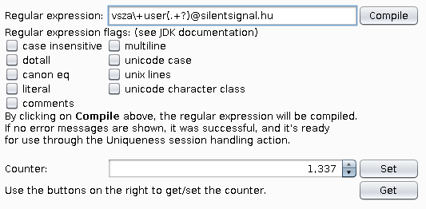
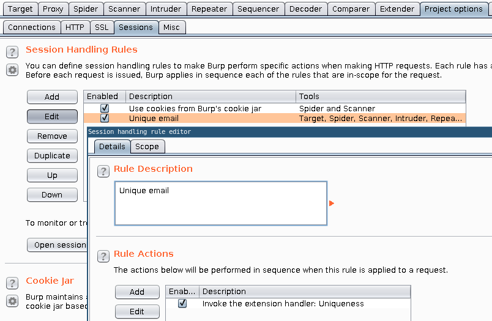
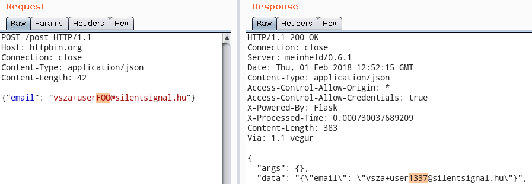

Uniqueness plugin for Burp Suite
================================

Makes requests unique based on regular expressions. Handy for registration
forms and any other endpoint that requires unique values upon every request.

Usage
-----

Install the extension, and a new tab called _Uniqueness_ appears with several options:

 - A regular expression can be entered in the text field, the first group
   will be replaced with the current value of the counter.
 - The behavior of the regular expression engine can be fine tuned with the
   flags that Java provides (see below).
 - The counter can be manually set to a specific value, and the current value
   can be queried on demand (the UI isn't updated automatically for performance
   reasons).

As it can be seen on the example in the screenshot above the list, the
regular expression uses the first (number 1) group after evaluation, so the
expression must contain at least one group (delimited by parentheses).
In regex, the 0th (also considered first by programmers) group contains the
whole expression, hence the above clarification regarding our use of the
first group, which is number 1, not 0.

The built-in regular expression engine of the Java runtime is used, their
interpretation of the standard, including character classes and flags can
be found in [the JDK documentation of java.util.regex.Pattern][1].

In the above example, anything between `user` and the @ sign will be replaced
in e-mail addresses starting with `vsza+user` and ending in `@silentsignal.hu`.
If pressing the _Compile_ button doesn't result in an error message, you're good
to go, and can continue with the next step.

In the _Session Handling Rules_ section of the _Sessions_ subtab of the
_Project options_ tab, you can add rules that trigger certain actions upon
the specified triggers.

Give a description you like and in the _Actions_ list, you can add an action that
invokes an extension handler, pick _Uniqueness_. You can also set a scope which
limits the subset of requests this rule will apply to on the other tab.

With the session handling rule in place, every tool within the scope of the rule
will invoke the magic of this plugin. Below is an example using _Repeater_.

Building
--------

Execute `ant`, and you'll have the plugin ready in `burp-uniqueness.jar`

Dependencies
------------

 - JDK 1.6+ (tested on OpenJDK `1.8.0_111`, Debian/Ubuntu package: `openjdk-8-jdk`)
 - Apache ANT (Debian/Ubuntu package: `ant`)

License
-------

The whole project is available under MIT license, see `LICENSE.txt`.

  [1]: https://docs.oracle.com/javase/8/docs/api/java/util/regex/Pattern.html
